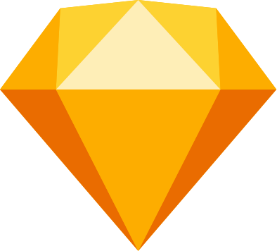

<h1>Привет! 👋</h1>

Меня зовут Елена и я **frontend-разработчик**.

### Контакты  💬

📞 <a href='tel:89227161602'>8-922-716-16-02</a> 

✉️ <a href='mailto:elena.gracheva.639@gmail.com'>elena.gracheva.639@gmail.com</a> 

<a href='https://t.me/elena_gracheva_639'>@elena_gracheva_639</a>

 <a href='https://vk.me/elhane'>Вконтакте</a>

 <a href='https://www.linkedin.com/in/elena-gracheva-b21917215'>LinkedIn</a>

### Мои навыки ⚙️

     
    &nbsp;&nbsp;
    &nbsp;&nbsp;
    &nbsp;&nbsp;
    &nbsp;&nbsp;
    &nbsp;&nbsp;
    &nbsp;&nbsp;
    &nbsp;&nbsp;
    &nbsp;&nbsp;
    &nbsp;
    &nbsp;&nbsp;
    &nbsp;&nbsp;
    &nbsp;&nbsp;
    &nbsp;&nbsp;
    &nbsp;&nbsp;
    &nbsp;&nbsp;
      
    &nbsp;&nbsp;
    &nbsp;&nbsp;
    &nbsp;&nbsp;
    &nbsp;&nbsp;
    
     

### Проекты 📚

| Название                                                                 | Год  | Тип                                                   | Описасние | Стек |
|--------------------------------------------------------------------------|------|-------------------------------------------------------|-----------------------------------------------------------------------------|---------------------------------------------|
| [6 cities](https://github.com/elhane/6-cities)                           | 2022 | 
🐈
      | [Work In Propgress] Сервис для поиска жилья| React, React-Router, Redux Toolkit, Leaflet |
| [What to Watch](https://github.com/elhane/what-to-watch)                 | 2022 | 
🎓
 | Приложение для просмотра фильмов        | React, React-Router, Redux Toolkit          |
| [Kustodiev](https://github.com/elhane/kustodiev)                         | 2021 | 
🎓
          | Галерея картин Бориса Кустодиева                                            | Vue, SCSS, Nuxt                             |
| [Israel](https://github.com/elhane/israel)                               | 2020 | 
🎓
          | Посадочная страница компании, которая возит студентов на стажировки в Израиль. | HTML, SCSS, JavaScript ES5, Gulp, БЭМ       |
| [Cruises to Antarctica](https://github.com/elhane/cruises-to-antarctica) | 2020 | 
🎓
          | Лендинг компании, специализирующейся на морских круизах в Антарктику.       | HTML, SCSS, JavaScript ES5, Gulp, БЭМ       |
| [Keksobooking](https://github.com/elhane/283879-keksobooking-20)         | 2020 | 
🎓
          | Сервис для размещения объявлений о сдаче недвижимости                       | HTML, CSS, JavaScript ES5                   |
| [Mishka](https://github.com/elhane/mishka)                               | 2020 | 
🎓
          | Интернет-магазин игрушек ручной работы                                      | HTML, CSS, LESS, Gulp, БЭМ                  |
| [Cat Energy](https://github.com/elhane/cat-energy)                       | 2020 | 
🎓
          | Интернет-магазин фитнес еды для котиков                                     | HTML, CSS, LESS, Gulp, БЭМ                  |
| [Gllacy](elhane.github.io/gllacy)                                        | 2020 | 
🎓
          | Интернет-магазин мороженого                                                 | HTML, CSS                                   |
| [Sedona](https://github.com/elhane/sedona)                               | 2020 | 
🎓
          | Сайт туристического городка в штате Аризона                                 | HTML, CSS                                   |

### О себе 👩‍💻

Мне нравится работа с интерфейсами. Интересуюсь React и его экосистемой, в будущем хочу продолжить изучение Vue и других фреймворков. С удовольствием верстаю.

До работы в IT занималась личным проектом ([brainy-kid.ru](https://brainy-kid.ru/) - авторские комплекты для развития детей). Благодаря этому научилась уверенно обращаться с основными графическими редакторами.

В свободное время люблю читать книги-антиутопии, смотреть фильмы и лекции об искусстве/истории, общаться с любимым котом :)
